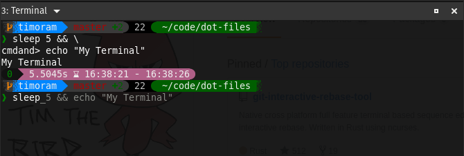

# Dot Profile

# Warning

**If you are not me, you SHOULD NOT install directly from this repository**

I will often completely break this repository while making changes. Which means that at any point this may completely
trash your command line, stop your system from booting *(it happened once)*, or worse. This is only tested on the few
systems that I run, and will probably not entirely work on other systems

After reading that warning, and you still want to give these dotfiles a try, first fork this repository, review the
code, and remove things you don’t want or need. Don’t blindly use my settings unless you know what that entails.

## Installation

**Note**

----

You may see warnings such as: "existing target is neither a link nor a directory: .bashrc". In those cases you will
need to manually delete those files first.

----

1. Clone the repo to a stable location
1. `cd <cloned-directory>`
1. `./scripts/install.bash`

## Update

1. `git pull` to get newest changes
1. `./scripts/install.bash` to link any new files

## Configuration

### Debug Mode

Setting `__DOTS_DEBUG=true` in `config.sh` will enable debug output.

### Local Files

Any shell file located in `~/.local/.dot-files` will be loaded after all other files have been loaded.

## Inspiration

- [janmoesen/tilde](https://github.com/janmoesen/tilde)
- [mathiasbynens/dotfiles](https://github.com/mathiasbynens/dotfiles)
- [cowboy/dotfiles](https://github.com/cowboy/dotfiles)
- [Kraymer/F-dotfiles](https://github.com/Kraymer/F-dotfiles)
- [xero/dotfiles](https://github.com/xero/dotfiles)

## License

This project is released under the ISC license. See [LICENSE](LICENSE).

[stow]:https://www.gnu.org/software/stow/
